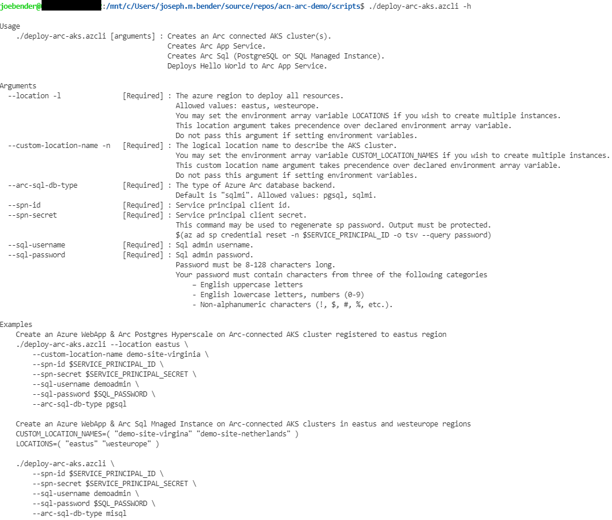

# Deploy Azure App Service on Azure Arc Connected AKS with Arc SQL Managed Intance

The [deploy-arc-aks.azcli](scripts/deploy-arc-aks.azcli) script will deploy a Hello World webapp on Azure App Service and an Arc SQL Managed Instance database backend, all on top of an Azure Arc connected AKS cluster. Deploying Arc PostgreSQL Hyperscale is also supported through the --arc-sql-db-type argument.

## Prerequisites

1. [Set up your Workstation](prerequisites.md)
1. Ensure azure-cli versions 2.26.0 or 2.26.1 are not installed (see Known Issues)

    ```bash
    # check azure-cli version
    az version
    # upgrade to 2.27.* if needed
    az upgrade
    ```
## Executing the script
1. Clone the repository to a local directory
1. Open a WSL2 terminal
1. Ensure you are logged in the azure-cli
1. Change directory to the 'scripts' folder where you cloned the repository
1. Execute the script
    ```bash
    SERVICE_PRINCIPAL_ID='<spn id>'
    SERVICE_PRINCIPAL_SECRET='<spn secret>'
    SQL_PASSWORD='<sql admin password>'
    ./deploy-arc-aks.azcli --location eastus \
        --custom-location-name my-site-virginia \
        --spn-id $SERVICE_PRINCIPAL_ID \
        --spn-secret $SERVICE_PRINCIPAL_SECRET \
        --sql-username exampleadmin \
        --sql-password $SQL_PASSWORD \
        --arc-sql-db-type sqlmi
    ```
1. Browse to the hello world webapp

The deploy-arc-aks.azcli script receives the following arguments:


## Microsoft Documentation References
- [Connect an existing Kubernetes cluster to Azure Arc](https://docs.microsoft.com/en-us/azure/azure-arc/kubernetes/quickstart-connect-cluster?tabs=azure-cli)
- [Set up an Azure Arc Kubernetes Cluster to run App Services](https://docs.microsoft.com/en-us/azure/app-service/manage-create-arc-environment)
- [App Service on Azure Arc (Preview)](https://docs.microsoft.com/en-us/azure/app-service/overview-arc-integration)
- [Azure Arc Data Controller - Direct Connectivity](https://docs.microsoft.com/en-us/azure/azure-arc/data/create-data-controller-direct-cli)
- [Arc-enabled Azure SQL Managed Instance](https://docs.microsoft.com/en-us/azure/azure-arc/data/create-sql-managed-instance)
- [Arc-enabled Azure PostgreSQL Hyperscale](https://docs.microsoft.com/en-us/azure/azure-arc/data/create-postgresql-hyperscale-server-group)


## Known Issues
- Azure CLI versions 2.26.1 & 2.26.0 currently fail during extension commands. Please use a newer version, or downgrade to known working version: 2.25.0-1.