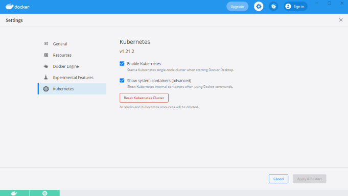
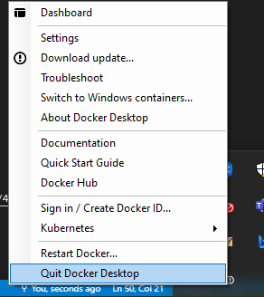
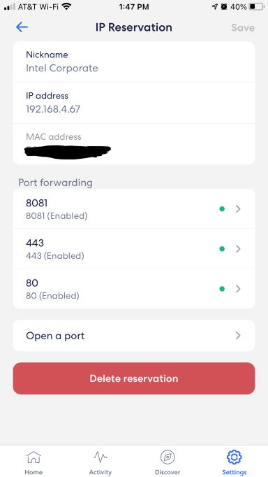
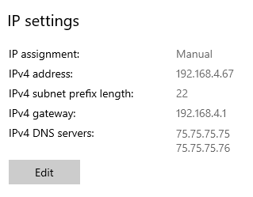
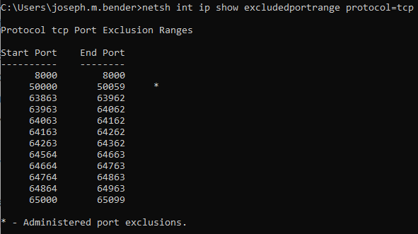
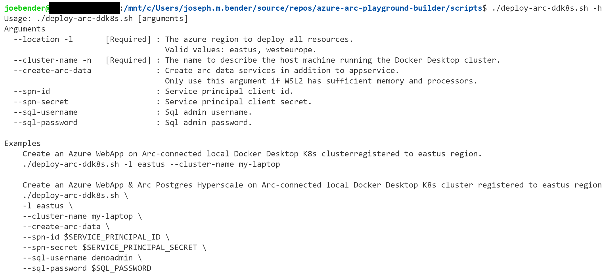

# Deploy Azure App Service on Azure Arc Docker Desktop Single Node Kubernetes
This document describes how to run the [deploy-arc-ddk8s.azcli](scripts/deploy-arc-ddk8s.azcli) script to accomplish: 
- Connect a local Docker Desktop single-node Kubernetes cluster to Azure Arc
- Install Azure App Service Extensions (Preview)
- Deploy a Hello World web app to the Azure App Service running in a local K8s cluster on Docker Desktop.
- [Optional] Install Azure Arc data services with Arc PostgreSQL Hyperscale

This documentation assumes running on a local host with the following ports exposed to internet: 80, 443, 8081. Access to network port forward configuration is required.

These instructions are also applicable with a public cloud provider VM having the same networking port configuration.

## Prerequisites
### Machine setup and WSL2 install on Windows
- [Set up your Workstation](prerequisites.md)
- If deploying Arc data services, this is the recommended resources WSL2 config. Smaller configurations might be insufficient to run both Arc Data Services + Arc App Service
    ```
    [wsl2]
    memory=16GB # Limits VM memory in WSL 2 to 16 GB
    processors=4 # Makes the WSL 2 VM use 4 virtual processors
    ```
- Ensure latest azure-cli version is installed

    ```bash
    # check azure-cli version
    az version
    # upgrade to at least 2.27.* if needed
    az upgrade
    ```

- Install the latest version of [yq](https://mikefarah.gitbook.io/yq/#install) on your WSL2 terminal

    ```bash
    # yq is only required by this script, not required when targeting an AKS cluster
    sudo apt-key adv --keyserver keyserver.ubuntu.com --recv-keys CC86BB64
    sudo add-apt-repository ppa:rmescandon/yq
    sudo apt update
    sudo apt install yq -y
    ```

- Login to your Azure Subscription using the azure-cli on your WSL2 terminal: 

    ```bash
    az login
    ```
- [Optional] If your account has multiple subscriptions, set the desired subscription by running:

    ```bash
    az account set -s <subscription-name-or-guid>
    ```

- Reset the Docker Desktop Kubernetes cluster

    

- Stop and Start Docker Desktop (do not restart, see [Troubleshooting](#troubleshooting))

    

### Create WSL2 mountpoints for persistent volume storage
This step is only required if creating data services. Arc Data services created by this script use dynamically provisioned local-storage persistent volumes. Docker Desktop WSL2 uses cross distro mounts. Mountpoints must be created in /mnt/wsl to be made available as viable volume mounts for Kubernetes pods. See [create-pv-mounts.sh](scripts/create-pv-mounts.sh) for more details. See this [thread](https://github.com/docker/for-win/issues/5325#issuecomment-567594291) for more WSL2 Docker Desktop mountpoint details. 

Execute the script to create directories & mountpoints in the WSL2 terminal. 

```bash
./create-pv-mounts.sh
```

### Configure port forwarding to your local machine 
1. Reserve a static IP for your local machine via your router's admin page
1. Enable TCP port-forwarding for the static IP on ports: 80, 443, 8081 via your router's admin page. (Note your router admin might look different than the screenshot below) 

    
1. Connect your local machine to your local network using the static IP

    

1. Add inbound and outbound OS firewall rules for ports 80, 443, 8081
1. Ensure none of the ports (80,443,8081) are reserved on your OS. For Windows - via CMD with Administrative Privileges
    ```bat
    # show the list of reserved ports 
    netsh int ip show excludedportrange protocol=tcp

    # stop the http service to release port 80 as reserved port
    net stop http /y
    ```
    

## Execute the script
**Complete all prerequisites before proceeding with these steps**

1. Open the [ddk8s.azcli]([ddk8s.azcli](scripts/ddk8s.azcli)) script
1. Open a WSL2 terminal
1. Ensure you are logged in the azure-cli
1. Change directory to the 'scripts' folder where you cloned the repository
1. Execute the script with required arguments
    ```bash
    ./deploy-arc-ddk8s.azcli -l eastus --cluster-name my-laptop
    ```

The following arguments are available in the deploy-arc-ddk8s script.

## Microsoft documentation
- [Connect an existing Kubernetes cluster to Azure Arc](https://docs.microsoft.com/en-us/azure/azure-arc/kubernetes/quickstart-connect-cluster?tabs=azure-cli)
- [Set up an Azure Arc Kubernetes cluster to run App Services](https://docs.microsoft.com/en-us/azure/app-service/manage-create-arc-environment)
- [App Service on Azure Arc (Preview)](https://docs.microsoft.com/en-us/azure/app-service/overview-arc-integration)
- [Azure Arc Data Controller - Direct Connectivity](https://docs.microsoft.com/en-us/azure/azure-arc/data/create-data-controller-direct-cli)
- [Arc Data Services Overview](https://docs.microsoft.com/en-us/azure/azure-arc/data/overview)
- [Arc Data Services Storage Configuration](https://docs.microsoft.com/en-us/azure/azure-arc/data/storage-configuration)


## Troubleshooting
### Kubernetes services external IP does not include localhost
Each time before running the Docker Desktop script, ensure to reset the Kubernetes cluster and stop and start (not restart) Docker Desktop. Failure to quit and start Docker Desktop so will cause the envoy Kubernetes service to not receive localhost ip assignment as an ExternalIP. Underlying issue is described [here](https://github.com/docker/for-mac/issues/4903)
### Unable to deploy or connect to Azure App Service
Ensure your port forwarding or network security group allows inbound and outbound traffic on 443, 80, and 8081.
### App Service extension build service pods are stuck in pending
A persistent volume is not created during app service extension helm chart install. 
The script will create it for you based on the yml file in scripts/appservice-extensions/pv.yml.
Ensure the persistent volume is created.
Ensure the persistent volume claim is created.
